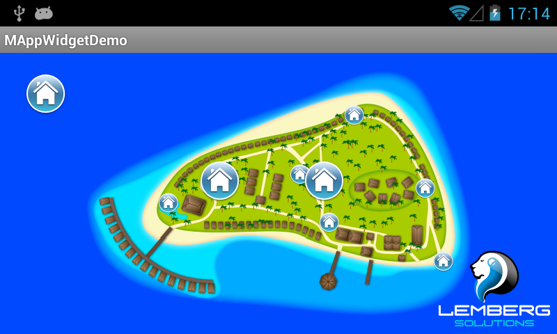
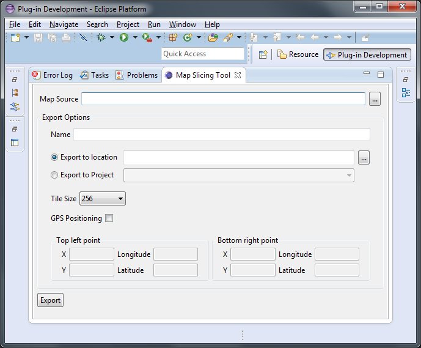

# Offline custom maps library for Android
mAppWidget is a code library designed for rapid design and integration of custom maps for Android mobile apps.

### Description
The repository contains the library, demo application and Eclipse plugin for maps slicing.
The library and demo application are Android Eclipse projects (uses ANT build system). Slicing plugin is an Eclipse plugin.

### How to use a library
To use the library just download and import it in your existing workspace.
Next you will have to add MapWidget view yo your layout and initialize it. Refer to BrowseMapActivity activity in mAppWigetDemo project for details.
To generate Javadocs execute the following command:
```
and javadoc
```
in mAppWidget directory. As a result "doc" directory will be created there.

### How to use slicing tool
Open Eclipse Standard 4.3.2 and import "slicingtool" project.
Now run this project as "Eclipse Application". As a result new Eclipse instance will be launched. Open "Map Slicing Tool" window:



and specify map source and slicing parameters.
The result of slicing are one XML and a bunch of PNG files in specified directory tree.
This directory tree should be placed in your project "assets" directory.
